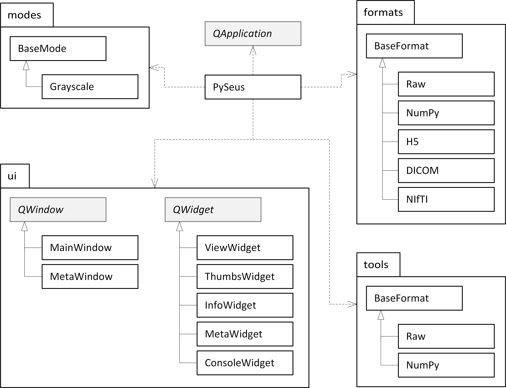

Overview
========

The package contains the PySeus application class and 5 subpackages.

**Formats**: Contains `format classes <formats.html>`_ that model
different data sources (file formats).

**Modes**: Contains `display mode classes <modes.html>`_ that
control the translation of values to color.

**Tools**: Contains `tool classes <tools.html>`_ that provide
different ways to evaluate data.

**UI**: Contains the main `GUI elements <interface.html>`_ for PySeus.

**Process**: Contains the main `Process elements <process.html>`_ for PySeus.

The grey elements are part of `PySide2 <https://pypi.org/project/PySide2/>`_, 
the Python wrapper used for the popular Qt GUI framework.
